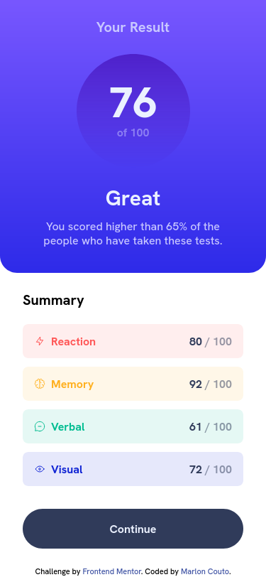
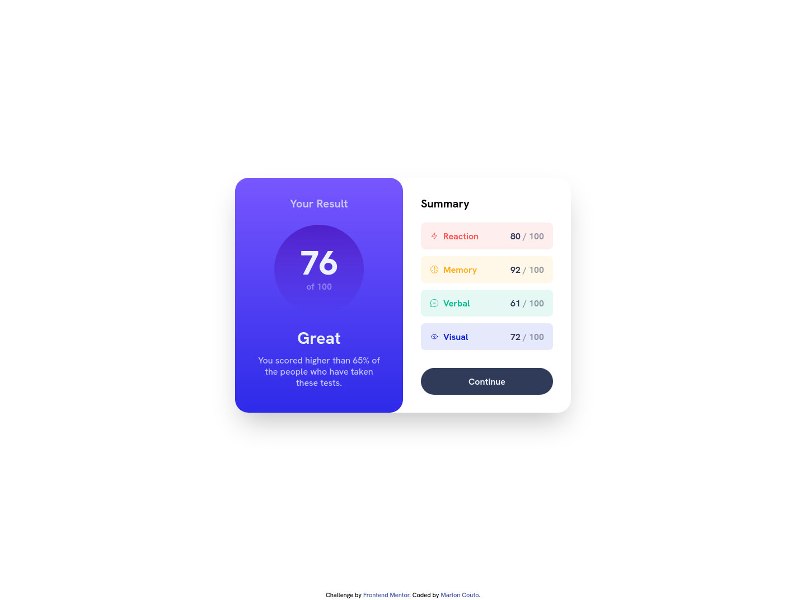

# Frontend Mentor - Results summary component solution

This is a solution to the [Results summary component challenge on Frontend Mentor](https://www.frontendmentor.io/challenges/results-summary-component-CE_K6s0maV). Frontend Mentor challenges help you improve your coding skills by building realistic projects.

## Table of contents

- [Overview](#overview)
  - [The challenge](#the-challenge)
  - [Screenshot](#screenshot)
  - [Links](#links)
- [My process](#my-process)
  - [Built with](#built-with)
  - [What I learned](#what-i-learned)
  - [Continued development](#continued-development)
  - [Useful resources](#useful-resources)
- [Author](#author)

## Overview

### The challenge

Users should be able to:

- View the optimal layout for the interface depending on their device's screen size
- See hover and focus states for all interactive elements on the page

### Screenshot

#### Mobile View



#### Desktop View



### Links

- Solution URL: [Frontend Mentor](https://your-solution-url.com)
- Live Site URL: [Vercel](https://your-live-site-url.comhttps://results-summary-component-eta.vercel.app/)

## My process

### Built with

- Semantic HTML5 markup
- Tailwind CSS classes
- Flexbox
- Mobile-first workflow

### What I learned

This project made me learn how breakpoints work in Tailwind, I managed to create a responsive layout quite easily by adding a few extra classes to the code

Example:

```html
<div
  class="p-6 bg-gradient-to-b from-gradient-light-slate-blue to-gradient-light-royal-blue rounded-b-3xl flex flex-col justify-center items-center space-y-6 md:h-full md:w-1/2 md:rounded-3xl"
></div>
```

In the code above the height, width and border radius of the div change as soon as the screen reaches a minimum size (768px).

### Continued development

Creating responsive layouts with Tailwind is something I want to improve. Mainly in the way of thinking about how to add the classes.

### Useful resources

- [Tailwind](https://tailwindcss.com/) - The Tailwind documentation is a great resource for research.
- [Brad Traversy](https://www.youtube.com/watch?v=UBOj6rqRUME) - This video helped me understand how to use Tailwind breakpoints.

## Author

- GitHub - [devpatola](https://github.com/devpatola)
- Frontend Mentor - [@devpatola](https://www.frontendmentor.io/profile/devpatola)
